Nama        : Chandra Bagus Sulaksono
Kelas       : SIB-3D
NIM         : 2241760079
Pertemuan   :3

# Praktikum 1
- Langkah 1:
Ketik atau salin kode program berikut ke dalam fungsi main().

- Langkah 2:
Silakan coba eksekusi (Run) kode pada langkah 1 tersebut. Apa yang terjadi? Jelaskan!

Jawab:
Penggunaan "Else If" dan "Else": Di Dart, kondisi else if dan else harus ditulis dengan huruf kecil sepenuhnya. Jadi, Else If dan Else dalam kode yang Anda berikan akan menghasilkan kesalahan sintaks karena tidak dikenali sebagai kata kunci yang valid. Yang benar adalah else if dan else.

Perbaikan source code:

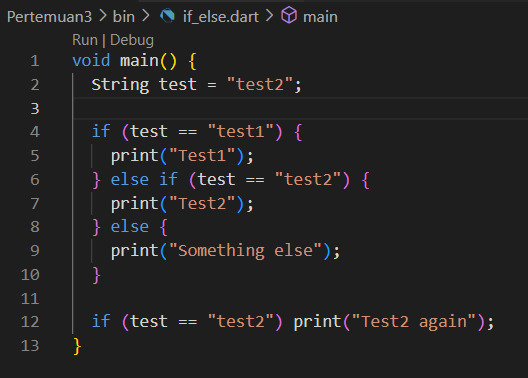

Output:

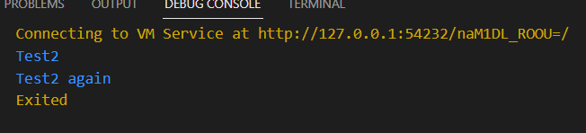

- Langkah 3:
Tambahkan kode program berikut, lalu coba eksekusi (Run) kode Anda.

Apa yang terjadi ? Jika terjadi error, silakan perbaiki namun tetap menggunakan if/else.
Jawab:
kondisi di dalam blok if harus berupa ekspresi boolean (true atau false). Anda mencoba menggunakan tipe data String dalam kondisi if, yang akan menyebabkan error. Jadi, if (test) akan menimbulkan kesalahan karena Dart tidak bisa mengonversi String menjadi boolean.

Perbaikan source code:

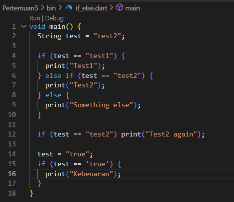

Output:

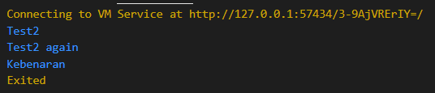

# Praktikum 2

- Langkah 1:

Ketik atau salin kode program berikut ke dalam fungsi main().

- Langkah 2:

Silakan coba eksekusi (Run) kode pada langkah 1 tersebut. Apa yang terjadi? Jelaskan! Lalu perbaiki jika terjadi error.

Jawab:

terjadi error karena variabel counter tidak diinisialisasi. Dalam program tersebut, counter belum dideklarasikan sebelum digunakan dalam kondisi while. Ini menyebabkan undefined variable error.

Perbaikan source code:

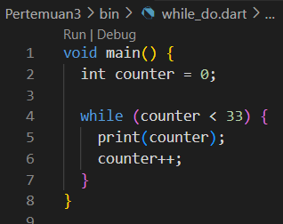

Output:

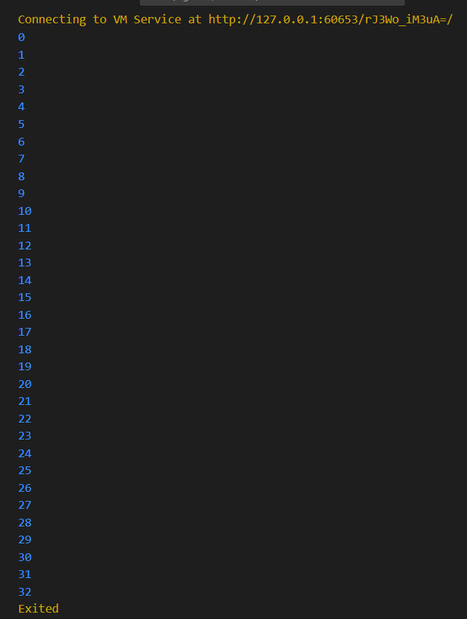

- Langkah 3:

Tambahkan kode program berikut, lalu coba eksekusi (Run) kode Anda.

Apa yang terjadi ? Jika terjadi error, silakan perbaiki namun tetap menggunakan do-while.

jawab:

Perbaikan source code:

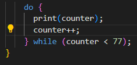

Output:

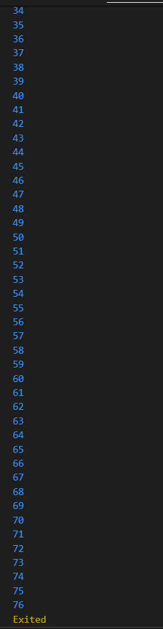

# Praktikum 3

- Langkah 1:

Ketik atau salin kode program berikut ke dalam fungsi main().

Perbaikan source code:

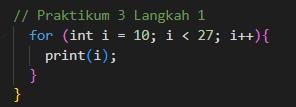

Output:

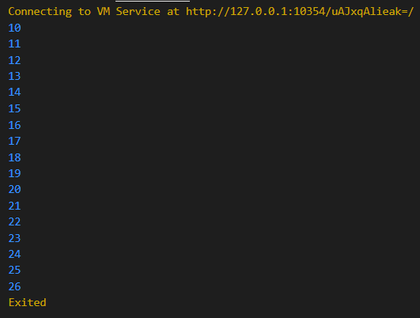

- Langkah 3:

Perbaikan source code:

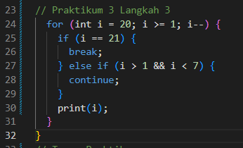

Output:

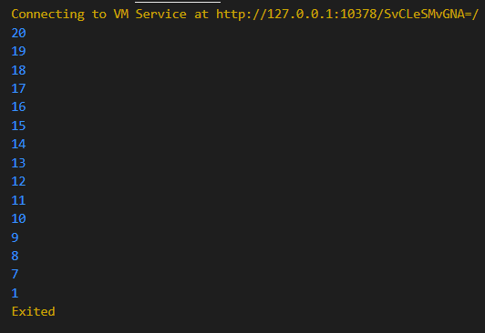

Jawab: kode mengalami error dan perlu perbaikan dengan memberikan looping for serta mengganti operator yg sebelumnya || menjadi &&, outputnya menampilkan angka 0,1 dan mengalami break, kemudian di lanjutkan ke angka 7 hingga 20.

# Tugas Praktikum

Output: 

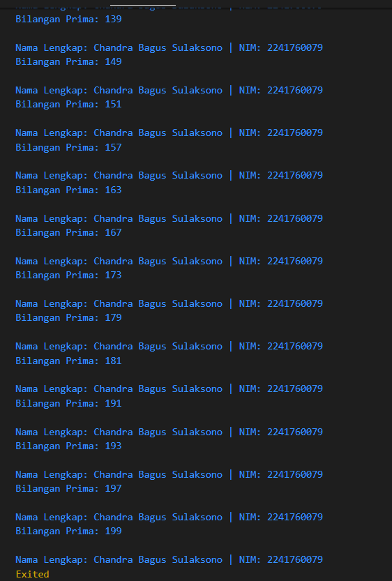

kode diatas menampilkan bilangan prima angka 0 sampai 201 dan setiap menampilkan bilangan prima akan tampil nama lengkap Fardiyani Afro'ul Yasinta dan NIM 2241760030.

dart-calculator 

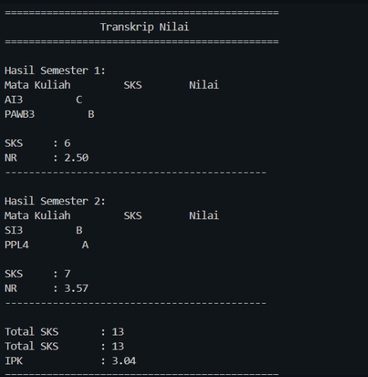

