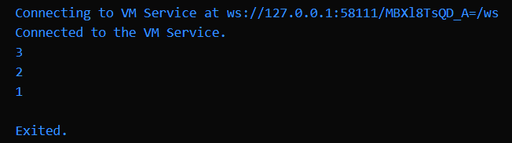
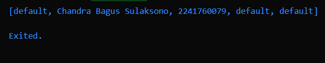
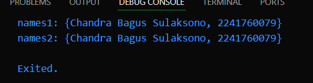
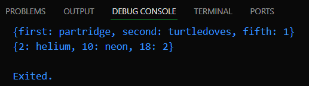
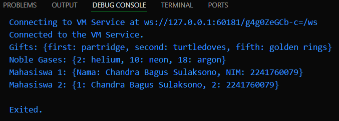

Nama    : Chandra Bagus Sulaksono
NIM     : 2241760079
Kelas   : SIB-3D

## Pertemuan 4
# Praktikum 1
- Langkah 1 & 2
Ketika saya eksekusi kode ini, beberapa hal terjadi:

Inisialisasi List: Di awal kode, sebuah list list = [1, 2, 3] dibuat yang berisi tiga elemen yaitu [1, 2, 3]. Ini mendefinisikan list dengan panjang 3 dan nilai-nilai awal tersebut.

Assert untuk Memastikan Kondisi Awal:

assert(list.length == 3); memastikan bahwa panjang list benar-benar 3, dan karena list memang memiliki tiga elemen, assert ini sukses.
assert(list[1] == 2); memastikan bahwa elemen kedua (indeks 1) adalah 2, dan memang benar elemen kedua adalah 2, sehingga assert ini juga berhasil.
Mencetak Nilai Awal: Kemudian, saya memanggil print(list.length); yang mencetak panjang list yaitu 3. Setelah itu, print(list[1]); mencetak nilai dari elemen kedua yang merupakan 2.

Memodifikasi Nilai List: Setelah itu, saya mengubah elemen kedua dalam list dari 2 menjadi 1 dengan list[1] = 1;. Sekarang, list berubah menjadi [1, 1, 3].

Assert Setelah Modifikasi: Untuk memastikan perubahan berhasil, saya memeriksa dengan assert(list[1] == 1); yang memastikan bahwa elemen kedua sekarang menjadi 1. Assert ini juga berhasil.

Mencetak Nilai Setelah Modifikasi: Terakhir, saya memanggil print(list[1]); yang sekarang mencetak nilai elemen kedua yang telah dimodifikasi menjadi 1.

- Output:


- Langkah 3
Jika kode ini dijalankan, akan terjadi error karena list yang dideklarasikan sebagai final tidak bisa dimodifikasi setelah dideklarasikan. Meskipun kita dapat mengubah isi dari elemen list yang biasa, deklarasi final pada list di Dart mengunci referensi list sehingga tidak bisa diubah, namun masih memungkinkan untuk mengubah nilai elemen-elemen di dalamnya.

Namun, jika kode di atas tetap menghasilkan error, kemungkinan lain adalah karena List.filled tidak mengizinkan modifikasi langsung pada elemennya, mengakibatkan error pada saat pengisian elemen.

- Output:


# Praktikum 2

- Langkah 1 & 2
Set di Dart: Set adalah koleksi unik dari elemen-elemen, di mana elemen tidak bisa duplikat. Jika kamu mencoba menambahkan elemen yang sudah ada di Set, itu tidak akan mempengaruhi Set karena elemen yang duplikat tidak diperbolehkan.
Urutan Elemen Tidak Terjamin: Saat mencetak Set, urutan elemen tidak dipertahankan dan mungkin berbeda setiap kali program dijalankan. Hal ini terjadi karena Set diimplementasikan secara internal untuk efisiensi penyimpanan dan pengambilan elemen, bukan untuk urutan tertentu.

- Langkah 3

names1 dan names2 sebagai Set:

names1.add(): Menambahkan nama dan NIM satu per satu menggunakan fungsi .add().
names2.addAll(): Menambahkan nama dan NIM sekaligus menggunakan fungsi .addAll(), yang dapat menerima daftar elemen.

Menghapus names3:
Karena names3 dideklarasikan sebagai Map, dan sesuai instruksi kita akan mencoba variabel Map di praktikum selanjutnya, names3 dihapus dari kode ini.
Output yang Diharapkan: Setelah kode dijalankan, hasil yang muncul akan mencetak Set names1 dan names2 yang sudah berisi nama dan NIM.

- Output
 

# Praktikum 3

- Langkah 1 & 2
Inisialisasi Map:

Map gifts: Map ini memiliki tiga pasangan kunci-nilai (key-value). Kunci berupa string 'first', 'second', dan 'fifth', sementara nilainya berupa dua string dan satu angka ('partridge', 'turtledoves', dan 1).
Map nobleGases: Map ini memiliki tiga pasangan kunci-nilai juga, namun kuncinya berupa angka (2, 10, 18) dan nilainya berupa string dan angka ('helium', 'neon', dan 2).

Pencetakan Map:
Saat print(gifts) dipanggil, Map gifts dicetak dengan format kunci-nilai, dan saat print(nobleGases) dipanggil, Map nobleGases juga dicetak dengan format yang sama.

- Output:


- Langkah 3
Inisialisasi dan Modifikasi Maps:

gifts: Map yang sudah ada dimodifikasi dengan menambahkan elemen 'fifth': 'golden rings'. Kode ini tidak menyebabkan error karena kita memang bisa menambahkan atau memodifikasi nilai pada Map yang sudah ada.
nobleGases: Map yang sudah ada dimodifikasi dengan menambahkan atau mengganti elemen 'argon' pada kunci 18. Kode ini juga tidak menyebabkan error karena Map di Dart fleksibel terhadap modifikasi seperti ini.

Deklarasi dan Modifikasi Map Baru (mhs1 dan mhs2):
mhs1: Sebuah Map kosong dideklarasikan dengan kunci berupa String. Nama dan NIM ditambahkan menggunakan kunci 'Nama' dan 'NIM'.
mhs2: Sebuah Map kosong dideklarasikan dengan kunci berupa int. Nama dan NIM ditambahkan menggunakan kunci integer (1 untuk nama, 2 untuk NIM).

Pencetakan Semua Map:
print('Gifts: $gifts'): Akan mencetak Map gifts.
print('Noble Gases: $nobleGases'): Akan mencetak Map nobleGases.
print('Mahasiswa 1: $mhs1'): Akan mencetak Map mhs1 yang berisi nama dan NIM dengan kunci String.
print('Mahasiswa 2: $mhs2'): Akan mencetak Map mhs2 yang berisi nama dan NIM dengan kunci int.



# Praktikum 4
- Langkah 1 & 2
Spread Operator (...):

Di Dart, operator ... disebut spread operator, yang digunakan untuk menambahkan semua elemen dari suatu koleksi (seperti list) ke dalam koleksi lain.
Pada baris var list2 = [0, ...list];, ini berarti elemen list2 adalah elemen 0 diikuti oleh semua elemen dari list (yaitu [1, 2, 3]). Jadi list2 akan menjadi [0, 1, 2, 3].

Pencetakan:
print(list);: Akan mencetak list asli [1, 2, 3].
print(list2);: Akan mencetak list baru yang berisi [0, 1, 2, 3].
print(list2.length);: Akan mencetak panjang dari list2, yaitu 4 karena ada empat elemen di dalam list2.

- Output:


- Langkah 3
Dari hasil implementasi kode ini, bahwa spread operator sangat berguna untuk menyebarkan elemen dari list lain, dan null-aware spread operator memungkinkan menangani situasi di mana list yang disebarkan mungkin mengandung nilai null. Selain itu, metode .split() memudahkan pemisahan string menjadi list karakter, sehingga bisa digunakan dalam konteks manipulasi data string seperti NIM atau kode unik lainnya.

- Output :


- Langkah 4
Deklarasi list1 dan penggunaan spread operator:

Bagian ini tidak mengalami perubahan. Program masih mendeklarasikan list1 yang berisi elemen 1, 2, dan null. Kemudian, list3 menggabungkan elemen-elemen dari list1 dengan menggunakan spread operator, disertai null-aware operator.

Pemecahan String NIM menjadi list karakter:
NIM dipecah menjadi karakter individual menggunakan metode .split(''), lalu dimasukkan ke dalam list nimList.

Penambahan kode untuk list nav dengan conditional list (if):
Variabel promoActive menentukan apakah elemen 'Outlet' akan ditambahkan ke dalam list nav.
Jika promoActive == true, maka 'Outlet' akan ditambahkan. Jika false, elemen 'Outlet' tidak ditambahkan.

- Output :


- Langkah 5
program dapat menambahkan elemen tambahan ke dalam list nav2 berdasarkan peran pengguna. Kita menggunakan kondisi sederhana dengan if dalam list untuk menambahkan elemen sesuai dengan nilai variabel login.

- Output :


- Langkah 6:
Deklarasi list1 dengan elemen null:

Kode ini membuat list yang berisi nilai [1, 2, null], lalu mencetak hasilnya.
Menggunakan Spread Operator dengan Null-aware Operator:

List list3 dibuat dengan menambahkan elemen 0 diikuti oleh elemen-elemen dari list1, di mana elemen null juga akan ditambahkan ke dalam list3. Hasil yang dicetak adalah [0, 1, 2, null] dengan panjang 4.
Memecah NIM menjadi List Karakter:

NIM '2241760079' dipecah menjadi karakter-karakter individual menggunakan metode .split('') dan hasilnya dicetak sebagai list karakter: ['2', '2', '4', '1', '7', '6', '0', '0', '7', '9'].
Kondisi promoActive untuk List nav:

Ketika promoActive bernilai true, elemen 'Outlet' akan ditambahkan ke dalam list nav. Hasilnya adalah: ['Home', 'Furniture', 'Plants', 'Outlet'].
Jika promoActive diubah menjadi false, maka list yang dicetak hanya berisi ['Home', 'Furniture', 'Plants'].
Kondisi login untuk List nav2:

Jika login bernilai 'Manager', maka elemen 'Inventory' akan ditambahkan ke dalam nav2. Hasilnya: ['Home', 'Furniture', 'Plants', 'Inventory'].
Jika login bernilai 'Admin', maka elemen 'Dashboard' akan ditambahkan, sehingga list akan mencetak ['Home', 'Furniture', 'Plants', 'Dashboard'].
Collection For:

Collection For adalah fitur Dart yang memungkinkan kita menggunakan perulangan (looping) langsung di dalam deklarasi list.
Pada bagian ini, kita membuat list listOfStrings yang mencakup elemen '#0' diikuti oleh hasil dari perulangan for pada listOfInts. Setiap angka dalam listOfInts diubah menjadi string dengan format #angka.
Hasilnya adalah: ['#0', '#1', '#2', '#3'].

- Output :


# Praktikum 5
- Langkah 1 & 2
record menyimpan:
'first': nilai posisi pertama.
a: 2: sebuah nilai dengan label a.
b: true: sebuah nilai dengan label b.
'last': nilai posisi terakhir tanpa label.

- Output:


- Langkah 3
Record Dekonstruksi: mendekonstruksi record menjadi variabel individu menggunakan sintaks (a, b) = record, sehingga memungkinkan kita untuk memanipulasi nilai-nilai dalam record dengan mudah.

Proses Pertukaran: Fungsi tukar() berhasil menukar dua nilai integer di dalam record dan mengembalikan record baru dengan nilai yang sudah ditukar.

- Output:


- Langkah 4
ecord digunakan untuk menyimpan beberapa nilai dengan tipe berbeda di dalam satu variabel.
Fungsi tukar() digunakan untuk menukar dua nilai dalam record.
Penambahan record mahasiswa berhasil dengan tipe (String, int), yang menyimpan nama dan NIM dan mencetaknya tanpa error.

- Output:


- Langkah 5
Record digunakan untuk menyimpan beberapa nilai dengan tipe berbeda di dalam satu variabel.
Fungsi tukar() digunakan untuk menukar dua nilai dalam record.
Penambahan record mahasiswa berhasil dengan tipe (String, int), yang menyimpan nama dan NIM dan mencetaknya tanpa error.

- Output:


## Tugas Praktikum

1. Silakan selesaikan Praktikum 1 sampai 5, lalu dokumentasikan berupa screenshot hasil pekerjaan Anda beserta penjelasannya!
Jawab: Sudah
2. Jelaskan yang dimaksud Functions dalam bahasa Dart!
Jawab: Functions dalam bahasa Dart adalah blok kode yang digunakan untuk menjalankan suatu tugas tertentu dan dapat dipanggil kapan saja dalam program. Functions mempermudah modularitas, memisahkan kode yang memiliki tujuan khusus, serta mendukung pengembangan kode yang lebih bersih dan terstruktur. Fungsi dapat menerima input berupa parameter dan mengembalikan output.

Contoh sederhana fungsi dalam Dart:
```dart
void hello() {
  print('Hello, World!');
}

void main() {
  hello(); // Memanggil fungsi hello
}
```
3. Jelaskan jenis-jenis parameter di Functions beserta contoh sintaksnya!
Jawab:
Dalam Dart, ada tiga jenis parameter yang bisa digunakan dalam functions:

Positional Parameters:
Parameter ini diposisikan berdasarkan urutannya.

Contoh sintaks:
```dart
void greet(String name, int age) {
  print('Hello $name, you are $age years old.');
}

void main() {
  greet('Alice', 21);
}
```
Optional Positional Parameters:

Parameter yang dapat diabaikan (opsional) dan biasanya ditandai dengan tanda kurung siku [].

Contoh sintaks:
```dart
void greet(String name, [int? age]) {
  print('Hello $name.');
  if (age != null) {
    print('You are $age years old.');
  }
}

void main() {
  greet('Alice');
}
```
Named Parameters:

Parameter yang dipanggil berdasarkan namanya, dan biasanya ditandai dengan kurung kurawal {}.

Contoh sintaks:
```dart
void greet({required String name, int? age}) {
  print('Hello $name.');
  if (age != null) {
    print('You are $age years old.');
  }
}

void main() {
  greet(name: 'Alice', age: 21);
}
```
4. Jelaskan maksud Functions sebagai first-class objects beserta contoh sintaknya!
Jawab:
Dalam Dart, functions adalah first-class objects, artinya functions dapat disimpan dalam variabel, dilewatkan sebagai parameter ke fungsi lain, dan dikembalikan oleh fungsi lain. Ini memungkinkan manipulasi fungsi secara fleksibel.

Contoh sintaknya
``` dart
void printMessage(String message) {
  print(message);
}

void executeFunction(Function f, String message) {
  f(message);
}

void main() {
  var myFunction = printMessage; // Fungsi disimpan dalam variabel
  executeFunction(myFunction, 'Hello, Dart!'); // Fungsi dipass ke parameter lain
}
```
5. Apa itu Anonymous Functions? Jelaskan dan berikan contohnya!
Jawab:
Anonymous functions (fungsi tanpa nama) adalah fungsi yang tidak memiliki nama dan biasanya digunakan secara langsung dalam konteks di mana fungsi tersebut diperlukan sekali saja. Anonymous functions bisa disimpan dalam variabel atau digunakan dalam parameter function lain.
Contoh sintak:
``` dart
void main() {
  var list = ['Apple', 'Banana', 'Orange'];

  list.forEach((item) {
    print(item); // Anonymous function yang dipanggil untuk setiap elemen
  });
}
```
6. Jelaskan perbedaan Lexical scope dan Lexical closures! Berikan contohnya!
Jawab: Dalam Dart, sebuah fungsi hanya bisa mengembalikan satu nilai. Namun, kita bisa mengakalinya dengan mengembalikan nilai dalam bentuk tuple  atau list/map untuk mengembalikan beberapa nilai.
Lexical Scope: Dalam Dart, scope sebuah variabel ditentukan oleh lokasi di mana variabel tersebut dideklarasikan dalam kode, bukan berdasarkan cara fungsi dipanggil. Ini berarti variabel hanya bisa diakses di dalam fungsi atau blok di mana ia dideklarasikan.

Contoh sintaknya:
```dart
void main() {
  int x = 5;
  void printX() {
    print(x); // Mengakses variabel x dari scope luar
  }
  printX(); // Mencetak 5
}
```
Lexical Closures: Lexical closure terjadi ketika fungsi yang didefinisikan di dalam fungsi lain "mengikat" variabel dari lingkungan sekitarnya, bahkan setelah fungsi induknya selesai dieksekusi. Closure menyimpan state variabel dari scope luar.
Contoh sintaknya:
```dart
Function makeMultiplier(int factor) {
  return (int x) => x * factor; // Ini closure yang mengakses 'factor'
}

void main() {
  var multiplier = makeMultiplier(3);
  print(multiplier(5)); // Output: 15
}
```
7. Jelaskan dengan contoh cara membuat return multiple value di Functions!
Jawab:
Dalam Dart, sebuah fungsi hanya bisa mengembalikan satu nilai. Namun, kita bisa mengakalinya dengan mengembalikan nilai dalam bentuk tuple atau list/map untuk mengembalikan beberapa nilai.
```dart
(String, int) getUser() {
  return ('Chandra Bagus Sulaksono', 2241760079); // Mengembalikan nama dan NIM
}

void main() {
  var (name, nim) = getUser();
  print('Name: $name, NIM: $nim');
}
```