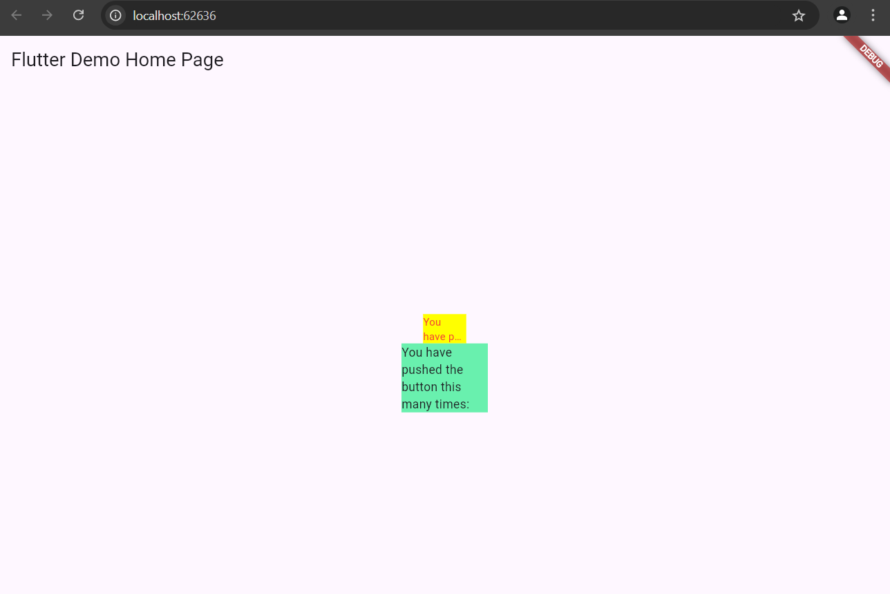

Nama : Chandra Bagus Sulaksono
Kelas : SIB-3D
NIM : 2241760079

# Praktikum Menerapkan Plugin di Project Flutter
- Langkah 4
Jawab: Error terjadi karena paket auto_size_text belum diimpor atau ditambahkan ke proyek. Untuk memperbaiki error ini, perlu mengimpor paket tersebut ke file Dart yang menggunakannya. Setelah itu, error tersebut akan teratasi dan AutoSizeText dapat digunakan tanpa masalah.

- Langkah 5
Jawab: 
final String text: Variabel ini menyimpan teks yang akan ditampilkan oleh widget. Dengan menggunakan final, variabel ini tidak dapat diubah setelah diinisialisasi, yang sesuai dengan prinsip StatelessWidget.

required this.text: Pada constructor, menandai text sebagai parameter yang required. Ini berarti bahwa ketika instance dari RedTextWidget dibuat, nilai text harus diberikan.

- Langkah 6
Jawab: 

RedTextWidget: Widget ini sekarang dimasukkan ke dalam Container dengan lebar 50 dan warna latar belakang kuning (yellowAccent). Teks dalam widget ini berwarna merah dan akan menyesuaikan ukuran berdasarkan ruang yang tersedia (berkat penggunaan AutoSizeText).

Text: Text standar dimasukkan ke dalam Container dengan lebar 100 dan latar belakang hijau (greenAccent). Ini adalah teks biasa yang tidak menggunakan AutoSizeText.

- Output:

Deskripsi: akan melihat dua Container dengan warna berbeda. Container pertama akan menggunakan RedTextWidget untuk menampilkan teks berwarna merah, sedangkan Container kedua akan menampilkan teks yang sama tanpa penyesuaian otomatis.

# Tugas Praktikum

1. Selesaikan Praktikum tersebut, lalu dokumentasikan dan push ke repository Anda berupa screenshot hasil pekerjaan beserta penjelasannya di file README.md!
2. Jelaskan maksud dari langkah 2 pada praktikum tersebut!
Jawab:
Menggunakan perintah flutter pub add auto_size_text akan secara otomatis menambahkan dependensi auto_size_text ke dalam file pubspec.yaml di proyek Flutter Anda, yang merupakan file konfigurasi untuk mengelola paket dan plugin yang digunakan oleh proyek tersebut.

Langkah ini bertujuan untuk mengintegrasikan plugin auto_size_text ke dalam proyek Flutter agar Anda dapat menggunakan fitur penyesuaian ukuran teks secara otomatis yang disediakan oleh plugin tersebut.

3. Jelaskan maksud dari langkah 5 pada praktikum tersebut!
Jawab: 
final String text;: Menyatakan variabel text sebagai variabel kelas bertipe String yang bersifat final, artinya nilai variabel ini tidak dapat diubah setelah diinisialisasi. Variabel ini digunakan untuk menyimpan teks yang akan ditampilkan oleh widget RedTextWidget.
final menunjukkan bahwa nilai text hanya dapat diberikan sekali

Langkah ini memungkinkan RedTextWidget menjadi lebih dinamis, karena widget ini sekarang dapat menerima teks berbeda setiap kali diinstansiasi. Dengan kata lain, alih-alih teks statis di dalam widget, bisa mengirimkan teks apa pun yang kita inginkan saat membuat instance RedTextWidget.

4. Pada langkah 6 terdapat dua widget yang ditambahkan, jelaskan fungsi dan perbedaannya!
Jawab:
RedTextWidget menggunakan AutoSizeText, yang menyesuaikan ukuran teks secara otomatis agar sesuai dengan ruang yang tersedia, sedangkan Text standar tidak menyesuaikan ukuran teks secara otomatis.

AutoSizeText bermanfaat ketika Anda ingin memastikan teks tidak terpotong atau melampaui batas kontainer, sedangkan Text standar cocok jika ukuran teks dapat diprediksi dan tidak memerlukan penyesuaian otomatis.

5. Jelaskan maksud dari tiap parameter yang ada di dalam plugin auto_size_text berdasarkan tautan pada dokumentasi ini !
Jawab: 

1. key:

    Deskripsi: Digunakan untuk mengontrol bagaimana satu widget menggantikan widget lain di dalam pohon widget. Setiap widget dalam Flutter dapat diberikan key untuk mengidentifikasi dan mengelola keadaan widget tersebut.

2. textKey:

    Deskripsi: Menetapkan key untuk widget Text yang dihasilkan. Sama seperti key pada widget, ini digunakan untuk melacak dan mengidentifikasi widget Text yang dihasilkan dalam pohon widget.

3. style:

    Deskripsi: Menentukan gaya untuk teks, seperti warna, ukuran font, ketebalan huruf, font family, dan lain-lain. Jika tidak null, ini mengontrol tampilan dari teks yang ditampilkan.

4. minFontSize:

    Deskripsi: Ukuran font minimum yang akan digunakan saat menyesuaikan ukuran teks secara otomatis. Ini adalah batas bawah ukuran font yang bisa diterapkan oleh AutoSizeText. Jika presetFontSizes disetel, ini akan diabaikan.

5. maxFontSize:

    Deskripsi: Ukuran font maksimum yang akan digunakan saat menyesuaikan ukuran teks. Jika presetFontSizes disetel, ini akan diabaikan.

6. stepGranularity:

    Deskripsi: Ukuran langkah penyesuaian font ketika ukuran font disesuaikan dengan batas yang tersedia. Ini menentukan seberapa besar perubahan ukuran font per langkah ketika AutoSizeText mengurangi atau meningkatkan ukuran font untuk mencocokkan ruang yang tersedia.

7. presetFontSizes:

    Deskripsi: Daftar ukuran font yang sudah didefinisikan yang dapat digunakan. Ukuran font yang diizinkan dalam daftar ini akan dicoba satu per satu hingga teks dapat dimuat dengan ukuran yang sesuai. presetFontSizes harus diatur dalam urutan menurun.

8. group:

    Deskripsi: Digunakan untuk mensinkronkan ukuran beberapa widget AutoSizeText. Ketika beberapa widget AutoSizeText digabungkan dalam satu grup, mereka akan menyesuaikan ukuran font mereka secara konsisten berdasarkan ruang yang tersedia.

9. textAlign:

    Deskripsi: Menentukan bagaimana teks harus disejajarkan secara horizontal, misalnya TextAlign.left, TextAlign.center, atau TextAlign.right.

10. textDirection:

    Deskripsi: Mengontrol arah teks, apakah teks ditampilkan dari kiri ke kanan (LTR) atau dari kanan ke kiri (RTL). Ini mengontrol bagaimana textAlign seperti TextAlign.start dan TextAlign.end diinterpretasikan.

11. locale:

    Deskripsi: Digunakan untuk memilih font berdasarkan wilayah atau bahasa yang dipilih. Ini berguna ketika teks yang sama mungkin harus dirender secara berbeda tergantung pada aturan regional atau lokal.

12. softWrap:

    Deskripsi: Menentukan apakah teks akan terputus di garis yang lembut (soft break). Jika diatur ke true, teks akan dipisahkan saat tidak muat dalam satu baris.

13. wrapWords:

    Deskripsi: Menentukan apakah kata yang tidak muat dalam satu baris akan dibungkus ke baris berikutnya. Jika diatur ke false, teks hanya akan menyusut jika seluruh kata dapat muat dalam satu baris.

14. overflow:

    Deskripsi: Mengontrol bagaimana teks yang meluap ditangani. Misalnya, TextOverflow.clip akan memotong teks yang tidak muat, dan TextOverflow.ellipsis akan menambahkan tiga titik di akhir teks yang meluap.

15. overflowReplacement:

    Deskripsi: Jika teks meluap dan tidak muat di dalam batas, widget pengganti ini akan ditampilkan. Ini bisa digunakan untuk menampilkan teks atau widget alternatif saat teks asli terlalu besar.

16. textScaleFactor:

    Deskripsi: Menentukan jumlah piksel font untuk setiap piksel logis. Ini juga memengaruhi minFontSize, maxFontSize, dan presetFontSizes.

17. maxLines:

    Deskripsi: Batasan jumlah maksimum baris yang dapat digunakan teks. Jika teks lebih panjang dari jumlah baris yang diizinkan, itu akan dipotong.

18. semanticsLabel:

    Deskripsi: Label semantik alternatif untuk teks ini. Ini berguna untuk tujuan aksesibilitas agar pembaca layar bisa memahami konten teks yang lebih baik.
    
6. Kumpulkan laporan praktikum Anda berupa link repository GitHub kepada dosen!