# #06 | Layout dan Navigasi

# Praktikum 1: : Membangun Layout di Flutter

- Output:
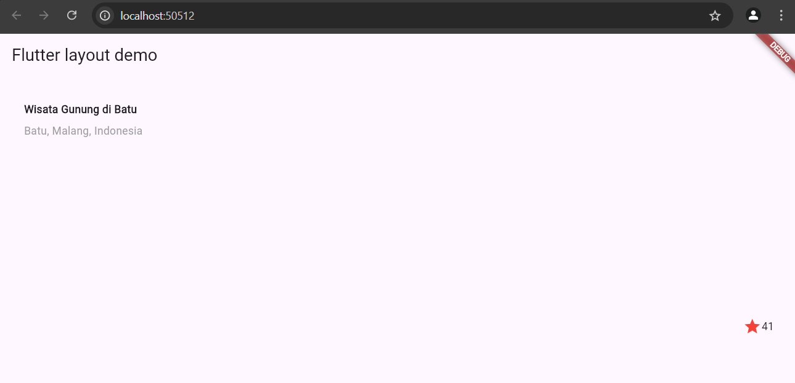
- deskripsi:
Pada tugas ini, saya diinstruksikan untuk membuat sebuah aplikasi Flutter sederhana yang menampilkan layout informasi tempat wisata menggunakan beberapa widget dasar Flutter, seperti Container, Row, Column, Text, Icon, dan Expanded. Aplikasi ini menggunakan pendekatan layout yang responsif dan dapat disesuaikan dengan berbagai ukuran layar.

Tujuan:

Memahami penggunaan widget Container, Row, Column, dan Expanded untuk membangun layout yang responsif.
Mempraktekkan teknik styling dan penataan widget menggunakan padding, warna teks, dan alignment.
Mengimplementasikan ikon dan teks yang terintegrasi dalam satu baris.
Langkah-langkah Implementasi:

Widget Container dan Padding: Saya menggunakan Container dengan padding 32 piksel di sepanjang tepinya untuk memberikan jarak antara konten dan tepi layar.

Widget Row dan Column: Di dalam Container, saya menambahkan widget Row untuk menampung dua bagian utama, yaitu informasi teks dan rating tempat wisata. Pada bagian pertama, saya menggunakan Column yang diatur dengan crossAxisAlignment: CrossAxisAlignment.start untuk menampilkan dua baris teks. Bagian ini terdiri dari nama tempat wisata ("Wisata Gunung di Batu") yang ditampilkan dengan font tebal, dan lokasi tempat wisata ("Batu, Malang, Indonesia") yang ditampilkan dalam warna abu-abu.

Widget Expanded: Saya menggunakan Expanded untuk memastikan bahwa kolom teks memenuhi ruang yang tersisa, sehingga memberikan tampilan yang lebih rapi saat di-render.

Penambahan Rating: Pada bagian kanan baris, saya menambahkan ikon bintang merah yang melambangkan rating tempat wisata, dan angka "41" sebagai nilai rating. Ini dicapai dengan menambahkan Icon dan Text dalam satu Row.

Judul Aplikasi: Saya juga mengubah judul aplikasi menjadi "Flutter layout: Nama dan NIM Anda" yang nantinya bisa diganti dengan nama dan NIM saya.

Hasil Akhir: Aplikasi berhasil menampilkan informasi tempat wisata "Wisata Gunung di Batu" dengan layout yang rapi dan informatif. Teks nama tempat wisata dan lokasinya diatur dengan baik menggunakan widget Column dan Expanded, sedangkan rating bintang ditampilkan pada bagian kanan dengan ikon bintang merah dan angka yang merepresentasikan rating. Tampilan ini sederhana namun efektif dalam menampilkan informasi yang dibutuhkan pengguna.

# Praktikum 2: : Membangun Layout di Flutter
- output:

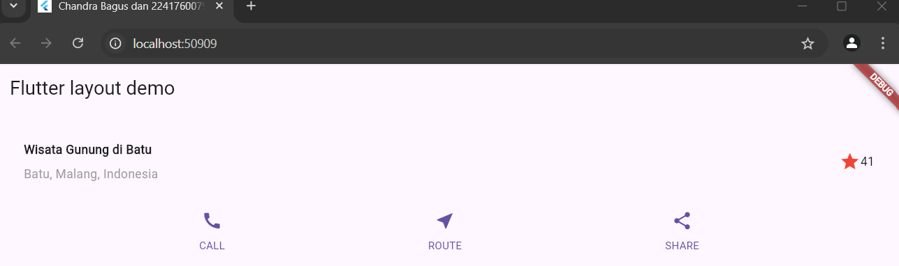

- deskripsi:
Pada tugas ini, saya diinstruksikan untuk mengembangkan aplikasi Flutter yang lebih interaktif dibandingkan dengan tugas sebelumnya. Aplikasi ini menampilkan informasi tentang tempat wisata serta menyediakan tiga tombol aksi (CALL, ROUTE, dan SHARE) di bagian bawah menggunakan beberapa widget dasar Flutter, seperti Row, Column, Icon, dan Text. Implementasi ini menggunakan fungsi untuk membangun kolom button yang berisi ikon dan label deskriptif.

Tujuan:

Mengimplementasikan interaksi dasar pada layout aplikasi Flutter menggunakan widget Icon dan Text.
Mempelajari cara mengatur layout secara dinamis dengan memanfaatkan widget Row dan Column.
Menggunakan metode reusable untuk membangun elemen UI yang berulang dengan memanfaatkan fungsi _buildButtonColumn().
Langkah-langkah Implementasi:

Title Section: Pada bagian atas aplikasi, saya membuat layout titleSection yang terdiri dari nama tempat wisata "Wisata Gunung di Batu" dan lokasi "Batu, Malang, Indonesia". Layout ini dibangun menggunakan Row dan Column untuk menyusun teks dan ikon rating bintang merah dengan angka rating "41". Struktur ini serupa dengan praktikum sebelumnya, dengan elemen yang ditata rapi menggunakan padding dan alignment.

Tombol Aksi (CALL, ROUTE, SHARE): Di bagian bawah layout, saya menambahkan tiga tombol aksi, yaitu "CALL", "ROUTE", dan "SHARE". Tombol ini ditampilkan menggunakan widget Row yang membagi ruang secara merata (mainAxisAlignment: MainAxisAlignment.spaceEvenly) sehingga ketiga tombol berukuran sama dan tampil sejajar.

Setiap tombol dibangun menggunakan kombinasi dari widget Column, Icon, dan Text, yang diimplementasikan melalui fungsi _buildButtonColumn(). Fungsi ini menerima parameter color, icon, dan label untuk menampilkan ikon dan teks di bawahnya secara dinamis. Warna ikon diambil dari tema utama aplikasi menggunakan Theme.of(context).primaryColor.

Fungsi Reusable: Untuk mengurangi pengulangan kode, saya membuat fungsi _buildButtonColumn(). Fungsi ini menerima ikon dan label sebagai parameter dan mengembalikan widget Column yang berisi ikon dan teks label. Hal ini mempermudah dalam pengembangan dan mempermudah untuk memodifikasi elemen UI secara konsisten.

Styling: Saya menambahkan beberapa pengaturan styling seperti fontWeight untuk teks dan fontSize untuk label pada tombol. Selain itu, ikon di setiap tombol diberi warna yang diambil dari tema aplikasi, menjadikannya lebih terintegrasi secara visual.

Hasil Akhir: Aplikasi berhasil menampilkan informasi tempat wisata dengan layout yang interaktif dan terorganisir dengan baik. Tombol CALL, ROUTE, dan SHARE terlihat sejajar dan dapat digunakan di masa depan untuk menambahkan fungsionalitas interaktif seperti pemanggilan nomor telepon, navigasi, dan berbagi konten. Fungsi reusable _buildButtonColumn() memungkinkan efisiensi dalam pengembangan UI yang berulang.

# Praktikum 3: Implementasi text section
- output:

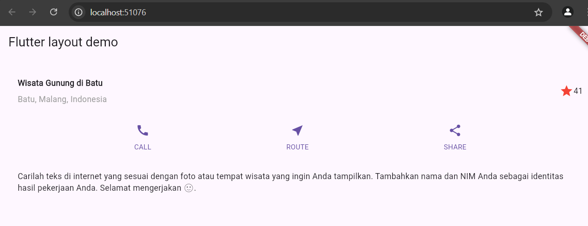

- deskripsi:
Pada tugas ini, saya diinstruksikan untuk mengembangkan aplikasi Flutter lebih lanjut dengan menambahkan bagian teks dinamis setelah button section. Aplikasi ini menampilkan informasi tentang tempat wisata serta tiga tombol aksi (CALL, ROUTE, dan SHARE) yang interaktif, serta tambahan teks deskriptif untuk menguji kemampuan menampilkan konten teks dengan layout yang rapi.

Tujuan:

Mengimplementasikan elemen layout dengan widget Text untuk menampilkan teks panjang yang dapat dibungkus secara otomatis.
Memperkuat kemampuan menggunakan widget Container dan Column untuk menyusun layout dengan berbagai jenis elemen.
Mengelola tata letak yang responsif dengan komponen interaktif dan teks deskriptif.
Langkah-langkah Implementasi:

Title Section:
Seperti pada tugas sebelumnya, bagian titleSection menampilkan nama tempat wisata "Wisata Gunung di Batu" beserta lokasinya "Batu, Malang, Indonesia". Layout ini diatur dengan Column dan Row, dengan teks yang diberi style dan padding untuk menciptakan jarak antara elemen-elemen dalam tampilan.

Button Section (CALL, ROUTE, SHARE):
Pada bagian ini, saya menambahkan tiga tombol interaktif (CALL, ROUTE, dan SHARE) yang diatur dalam widget Row dengan mainAxisAlignment: MainAxisAlignment.spaceEvenly. Ketiga tombol ini dibuat menggunakan fungsi _buildButtonColumn() yang mengembalikan widget Column berisi ikon dan label deskriptif. Hal ini memudahkan dalam membuat tampilan yang seragam untuk setiap tombol.

Penambahan Teks Deskriptif:
Saya menambahkan sebuah widget textSection yang menampilkan teks panjang berisi instruksi untuk mencari teks di internet yang sesuai dengan tempat wisata yang ingin ditampilkan. Teks ini dibuat menggunakan widget Text dengan properti softWrap: true untuk memastikan teks dapat dibungkus sesuai dengan lebar layar. Container digunakan untuk memberikan padding yang konsisten di sekitar teks agar tampilan lebih rapi dan mudah dibaca.

Penggunaan Fungsi Reusable:
Untuk tombol interaktif, saya memanfaatkan fungsi _buildButtonColumn() yang menerima parameter warna, ikon, dan label teks untuk memudahkan pengembangan UI secara konsisten dan efisien. Fungsi ini mengembalikan sebuah Column yang memuat ikon dan teks dalam satu kesatuan.

Hasil Akhir:
Aplikasi berhasil menampilkan informasi wisata dengan layout yang baik dan interaktif. Teks deskriptif di bagian bawah menambahkan konteks pada aplikasi dan memberikan ruang untuk informasi lebih lanjut. Tombol interaktif CALL, ROUTE, dan SHARE ditata dengan rapi di tengah layout dan berfungsi sebagai elemen interaksi yang siap untuk diintegrasikan dengan fungsionalitas lebih lanjut.

# Praktikum 4: Implementasi image section

- Output:
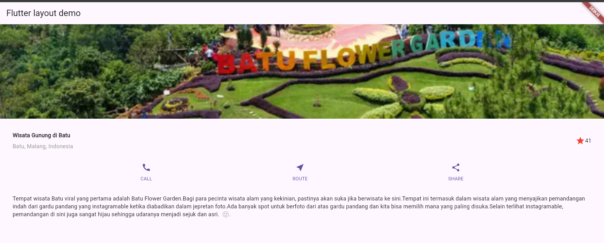

- deskripsi:

Bagian imageSection dalam kode Flutter ini berfungsi untuk menampilkan gambar tempat wisata secara visual. Widget Image.asset digunakan untuk mengambil gambar dari aset lokal aplikasi, kemudian diatur ukuran dan cara penyesuaiannya terhadap wadah menggunakan properti width, height, dan fit.
Elemen imageSection berperan penting dalam memberikan kesan visual yang menarik pada aplikasi. Dengan menggunakan BoxFit.cover, gambar akan selalu mengisi seluruh area yang disediakan, sehingga tampilannya lebih konsisten di berbagai ukuran layar.

# Praktikum 5: Membangun Navigasi di Flutter

# Praktikum 5

- Langkah 1,2, dan 3
- output:

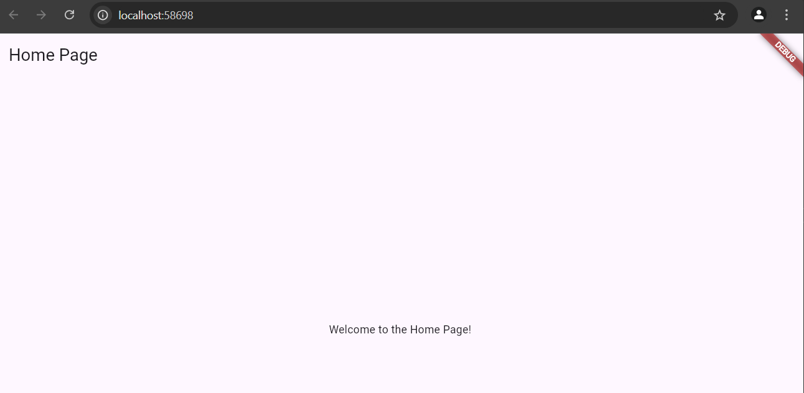

- Deskripsi:

Ketika aplikasi dimulai, MaterialApp akan menggunakan initialRoute untuk menentukan halaman mana yang akan ditampilkan pertama kali. Dalam hal ini, HomePage akan menjadi halaman pertama karena dihubungkan dengan route '/'.
Pengguna dapat berpindah ke halaman ItemPage dengan mengakses route '/item'. Ini dilakukan dengan navigasi, biasanya menggunakan Navigator.pushNamed(context, '/item');.

bertujuan untuk membuat dua halaman, HomePage dan ItemPage, dengan mekanisme navigasi di antara kedua halaman menggunakan named routes. MaterialApp mengelola transisi antar halaman dan menampilkan halaman awal berdasarkan nilai dari initialRoute.

- Langkah 4,5
- output:

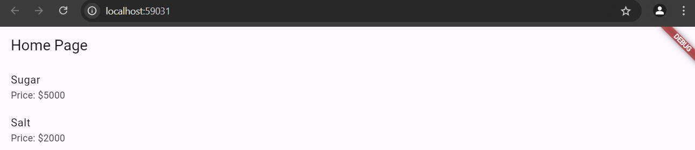

- Deskripsi:

List<Item> items: Ini adalah daftar item yang diambil dari model Item. Pada contoh ini, terdapat dua item, yaitu Sugar dengan harga 5000 dan Salt dengan harga 2000.

ListView.builder: Ini adalah widget yang digunakan untuk menampilkan daftar item dalam bentuk list. Kelebihan dari ListView.builder adalah kemampuannya untuk memuat item secara dinamis berdasarkan jumlah data yang ada dalam list.

    itemCount: Menunjukkan jumlah item yang ada dalam List<Item> items.
    itemBuilder: Digunakan untuk membangun setiap item berdasarkan indeks yang diberikan.

ListTile: Ini adalah widget untuk menampilkan item dalam bentuk baris. Setiap ListTile menampilkan nama item (item.name) dan harga item (item.price).

Navigator.pushNamed: Ini digunakan untuk berpindah ke halaman ItemPage saat item diklik. Data item yang diklik akan dikirim sebagai argumen menggunakan arguments.

- Langkah 6
- output:

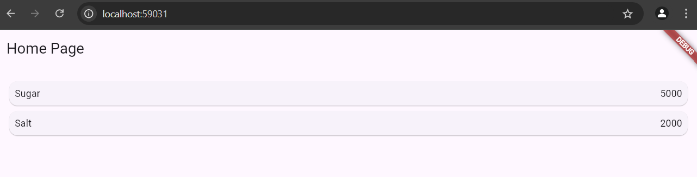

- Deskripsi:

Setiap item (Sugar, Salt) akan ditampilkan dalam sebuah kartu dengan nama di sisi kiri dan harga di sisi kanan. Jarak antara kartu-kartu ini diatur dengan margin yang diberikan pada Card dan Container.
Kartu untuk setiap item akan memiliki margin internal untuk memastikan tampilan lebih teratur.

- Langkah 7
- output:

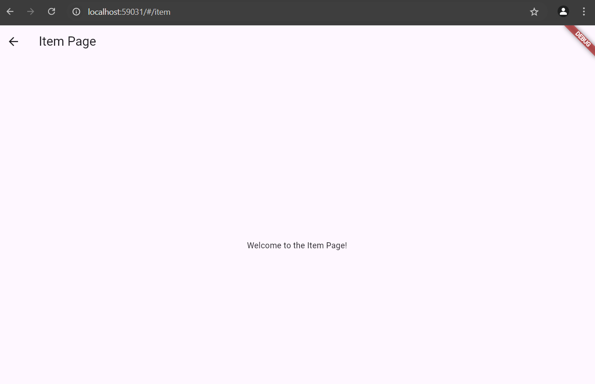

- Deskripsi:

InkWell:

    InkWell membungkus Card dan digunakan untuk mendeteksi aksi sentuhan pada setiap item.
    onTap: Pada saat item ditekan, aksi akan dijalankan. Dalam hal ini, menggunakan Navigator.pushNamed untuk berpindah ke halaman lain (ItemPage) dan mengirim data Item ke halaman tersebut melalui argumen.

Navigator.pushNamed:

    Navigator.pushNamed(context, '/item', arguments: item) akan memanggil route dengan nama '/item' yang telah didefinisikan sebelumnya dan membawa data item yang dipilih.

    Setelah kode ini dijalankan:

    - Setiap item dalam ListView akan dapat ditekan.
    - Ketika item ditekan, aplikasi akan berpindah ke halaman ItemPage, dan data item yang dipilih akan dikirim ke halaman tersebut.
    - Efek visual dari InkWell akan memberikan feedback visual saat item ditekan.

    # Tugas Praktikum 2
1. Untuk melakukan pengiriman data ke halaman berikutnya, cukup menambahkan informasi arguments pada penggunaan Navigator. Perbarui kode pada bagian Navigator menjadi seperti berikut.

Jawab: 
Navigator.pushNamed:

Pada halaman HomePage, menggunakan Navigator.pushNamed untuk berpindah ke halaman ItemPage dengan menambahkan parameter arguments.
arguments: item:  mengirimkan data item (yang berupa objek dari model Item) ke halaman ItemPage.

Menerima Argumen di ItemPage:

Di ItemPage, menggunakan ModalRoute.of(context)!.settings.arguments untuk mendapatkan data yang dikirim melalui Navigator.
Argumen yang diterima di-cast ke dalam tipe Item agar kita bisa mengakses propertinya seperti name dan price.

Menampilkan Data:

Setelah menerima data item,  dapat menampilkan informasi seperti item.name di AppBar dan item.price di body halaman.

- output:

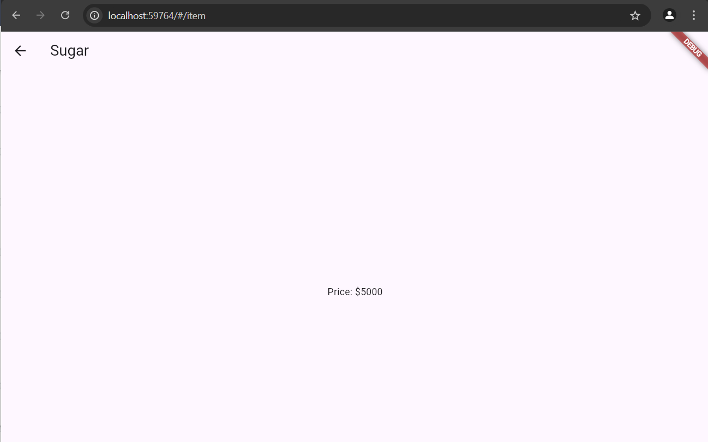

2. Pembacaan nilai yang dikirimkan pada halaman sebelumnya dapat dilakukan menggunakan ModalRoute. Tambahkan kode berikut pada blok fungsi build dalam halaman ItemPage. Setelah nilai didapatkan, anda dapat menggunakannya seperti penggunaan variabel pada umumnya. (https://docs.flutter.dev/cookbook/navigation/navigate-with-arguments)

Jawab: Dengan perubahan ini, dapat mengirimkan data antar halaman menggunakan Navigator.pushNamed dan ModalRoute untuk menangkap argumen yang dikirim, lalu menampilkannya dalam format yang sesuai.

3. Pada hasil akhir dari aplikasi belanja yang telah anda selesaikan, tambahkan atribut foto produk, stok, dan rating. Ubahlah tampilan menjadi GridView seperti di aplikasi marketplace pada umumnya.

Jawab: 
Tampilan dalam GridView: Produk ditampilkan dalam format GridView yang menampilkan dua item per baris, dengan foto produk, nama, harga, stok, dan rating.
Navigasi ke Halaman Detail: Ketika produk diklik, pengguna akan diarahkan ke halaman detail yang menampilkan informasi lebih rinci tentang produk yang dipilih.
Foto, Stok, dan Rating: Informasi tambahan seperti foto, stok, dan rating kini ditampilkan untuk setiap produk.

- output:

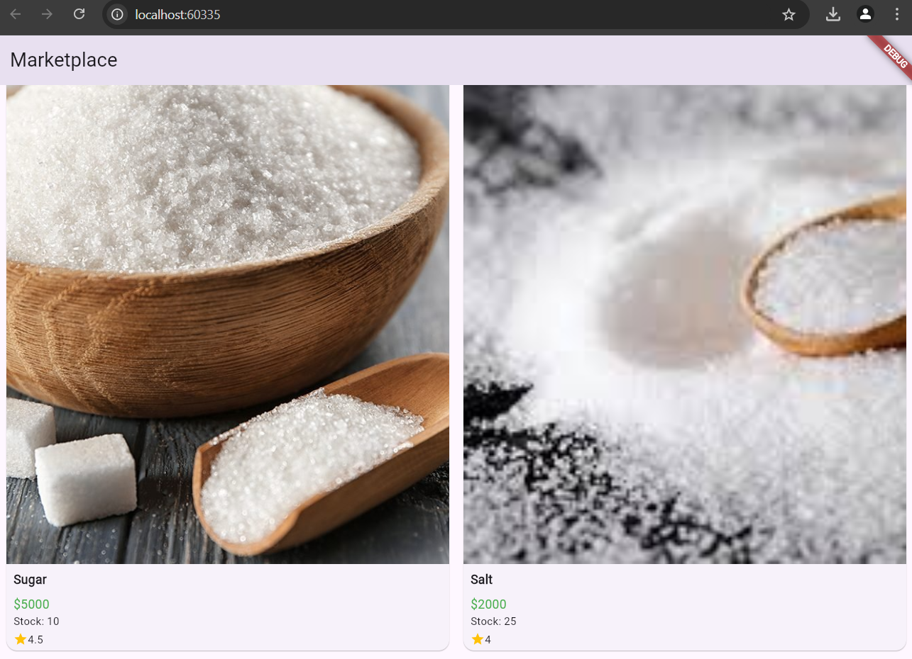

4. Silakan implementasikan Hero widget pada aplikasi belanja Anda dengan mempelajari dari sumber ini: https://docs.flutter.dev/cookbook/navigation/hero-animations

Jawab: 
HomePage: Pada bagian gambar produk di dalam GridView, membungkusnya dengan widget Hero. Setiap Hero memiliki properti tag yang unik, dan untuk produk ini kita menggunakan item.name sebagai tag unik.

ItemPage: membungkus gambar produk dengan Hero widget menggunakan tag yang sama. Dengan begitu, ketika pengguna mengetuk gambar produk, gambar tersebut akan bertransisi dengan animasi halus dari HomePage ke ItemPage.

- Hero widget membuat transisi antar halaman menjadi lebih interaktif dan memberikan pengalaman yang lebih halus bagi pengguna.
- Dengan mengimplementasikan Hero di aplikasi belanja Anda, gambar produk akan memiliki animasi yang menghubungkan tampilan grid di HomePage dengan tampilan detail di ItemPage.

- output:

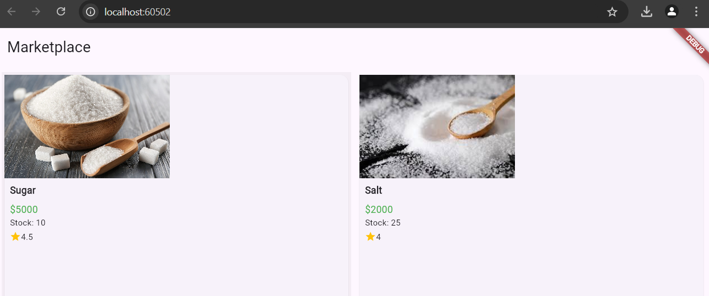

5. Sesuaikan dan modifikasi tampilan sehingga menjadi aplikasi yang menarik. Selain itu, pecah widget menjadi kode yang lebih kecil. Tambahkan Nama dan NIM di footer aplikasi belanja Anda.

Jawab: 

- Modularisasi: Dengan memecah widget menjadi komponen yang lebih kecil seperti ProductGridItem dan Footer, aplikasi menjadi lebih mudah dikelola dan terstruktur.
- Desain yang Lebih Menarik: Menggunakan Card, Hero, GridView, dan padding yang tepat memberikan tampilan yang lebih modern dan menarik.
- Footer dengan Nama dan NIM: Menambahkan footer yang berisi nama dan NIM menambah informasi yang relevan di bagian bawah aplikasi.

- output:

