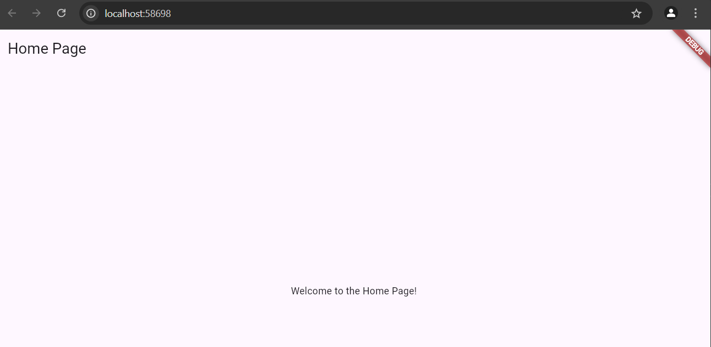
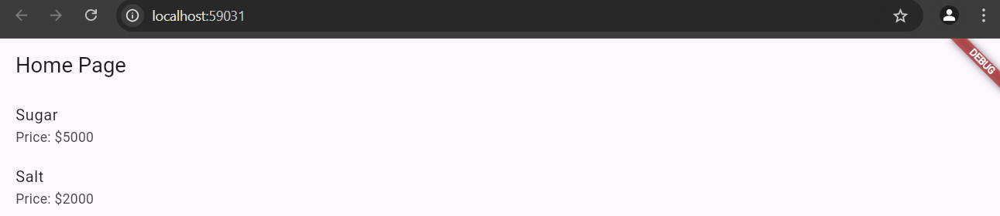
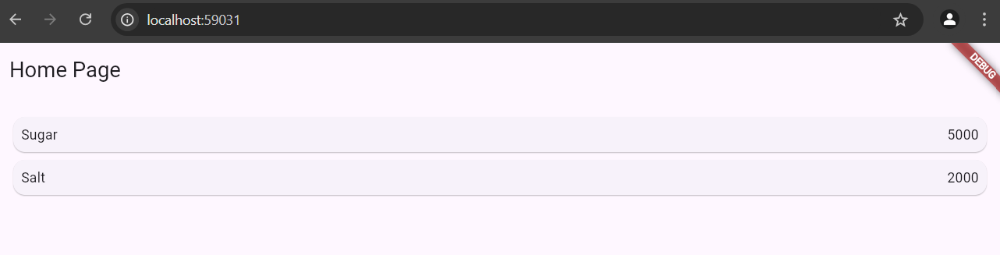
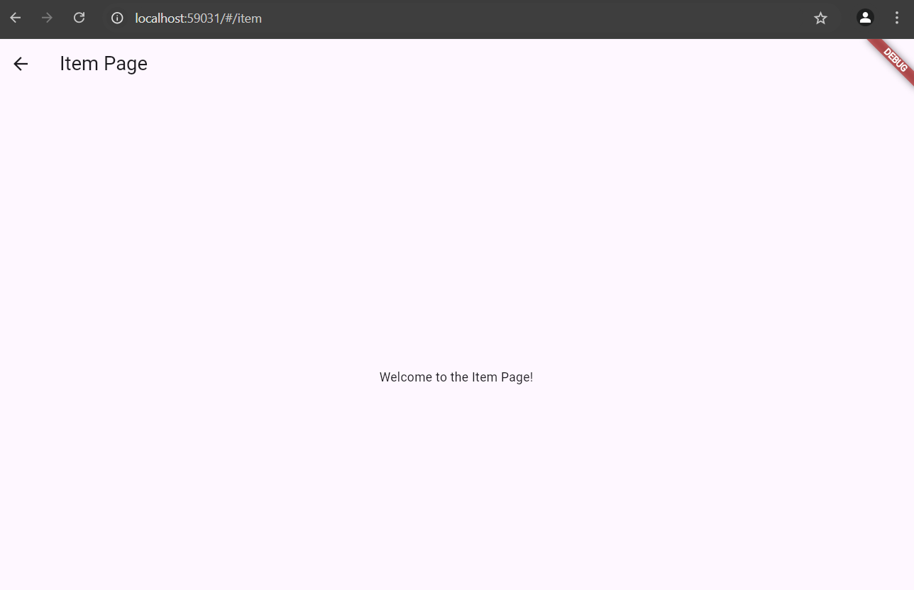
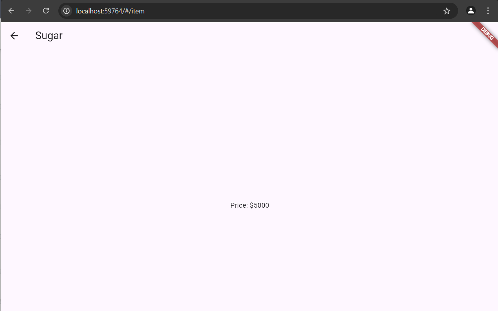
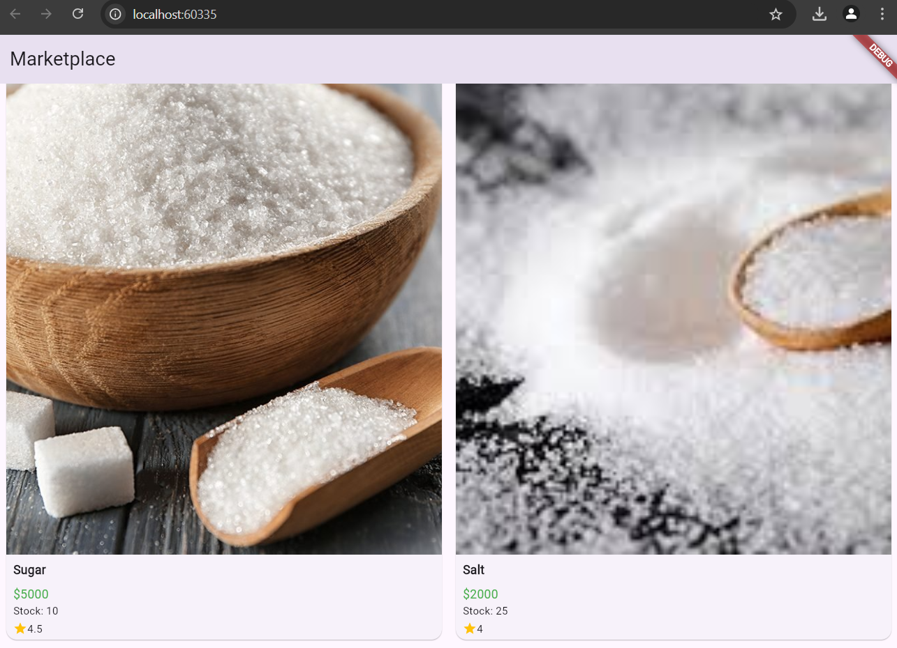
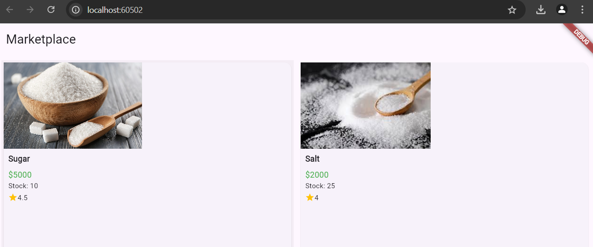

# Praktikum 5

- Langkah 1,2, dan 3
- output:

- Deskripsi:

Ketika aplikasi dimulai, MaterialApp akan menggunakan initialRoute untuk menentukan halaman mana yang akan ditampilkan pertama kali. Dalam hal ini, HomePage akan menjadi halaman pertama karena dihubungkan dengan route '/'.
Pengguna dapat berpindah ke halaman ItemPage dengan mengakses route '/item'. Ini dilakukan dengan navigasi, biasanya menggunakan Navigator.pushNamed(context, '/item');.

bertujuan untuk membuat dua halaman, HomePage dan ItemPage, dengan mekanisme navigasi di antara kedua halaman menggunakan named routes. MaterialApp mengelola transisi antar halaman dan menampilkan halaman awal berdasarkan nilai dari initialRoute.

- Langkah 4,5
- output:

- Deskripsi:

List<Item> items: Ini adalah daftar item yang diambil dari model Item. Pada contoh ini, terdapat dua item, yaitu Sugar dengan harga 5000 dan Salt dengan harga 2000.

ListView.builder: Ini adalah widget yang digunakan untuk menampilkan daftar item dalam bentuk list. Kelebihan dari ListView.builder adalah kemampuannya untuk memuat item secara dinamis berdasarkan jumlah data yang ada dalam list.

itemCount: Menunjukkan jumlah item yang ada dalam List<Item> items.
itemBuilder: Digunakan untuk membangun setiap item berdasarkan indeks yang diberikan.

ListTile: Ini adalah widget untuk menampilkan item dalam bentuk baris. Setiap ListTile menampilkan nama item (item.name) dan harga item (item.price).

Navigator.pushNamed: Ini digunakan untuk berpindah ke halaman ItemPage saat item diklik. Data item yang diklik akan dikirim sebagai argumen menggunakan arguments.

- Langkah 6
- output:

- Deskripsi:

Setiap item (Sugar, Salt) akan ditampilkan dalam sebuah kartu dengan nama di sisi kiri dan harga di sisi kanan. Jarak antara kartu-kartu ini diatur dengan margin yang diberikan pada Card dan Container.
Kartu untuk setiap item akan memiliki margin internal untuk memastikan tampilan lebih teratur.

- Langkah 7
- output:

- Deskripsi:

InkWell:
InkWell membungkus Card dan digunakan untuk mendeteksi aksi sentuhan pada setiap item.
onTap: Pada saat item ditekan, aksi akan dijalankan. Dalam hal ini, menggunakan Navigator.pushNamed untuk berpindah ke halaman lain (ItemPage) dan mengirim data Item ke halaman tersebut melalui argumen.

Navigator.pushNamed:

Navigator.pushNamed(context, '/item', arguments: item) akan memanggil route dengan nama '/item' yang telah didefinisikan sebelumnya dan membawa data item yang dipilih.

Setelah kode ini dijalankan:

- Setiap item dalam ListView akan dapat ditekan.
- Ketika item ditekan, aplikasi akan berpindah ke halaman ItemPage, dan data item yang dipilih akan dikirim ke halaman tersebut.
- Efek visual dari InkWell akan memberikan feedback visual saat item ditekan.

# Tugas Praktikum 2
1. Untuk melakukan pengiriman data ke halaman berikutnya, cukup menambahkan informasi arguments pada penggunaan Navigator. Perbarui kode pada bagian Navigator menjadi seperti berikut.

Jawab: 
Navigator.pushNamed:

Pada halaman HomePage, menggunakan Navigator.pushNamed untuk berpindah ke halaman ItemPage dengan menambahkan parameter arguments.
arguments: item:  mengirimkan data item (yang berupa objek dari model Item) ke halaman ItemPage.

Menerima Argumen di ItemPage:

Di ItemPage, menggunakan ModalRoute.of(context)!.settings.arguments untuk mendapatkan data yang dikirim melalui Navigator.
Argumen yang diterima di-cast ke dalam tipe Item agar kita bisa mengakses propertinya seperti name dan price.

Menampilkan Data:

Setelah menerima data item,  dapat menampilkan informasi seperti item.name di AppBar dan item.price di body halaman.

- output:

2. Pembacaan nilai yang dikirimkan pada halaman sebelumnya dapat dilakukan menggunakan ModalRoute. Tambahkan kode berikut pada blok fungsi build dalam halaman ItemPage. Setelah nilai didapatkan, anda dapat menggunakannya seperti penggunaan variabel pada umumnya. (https://docs.flutter.dev/cookbook/navigation/navigate-with-arguments)

Jawab: Dengan perubahan ini, dapat mengirimkan data antar halaman menggunakan Navigator.pushNamed dan ModalRoute untuk menangkap argumen yang dikirim, lalu menampilkannya dalam format yang sesuai.

3. Pada hasil akhir dari aplikasi belanja yang telah anda selesaikan, tambahkan atribut foto produk, stok, dan rating. Ubahlah tampilan menjadi GridView seperti di aplikasi marketplace pada umumnya.

Jawab: 
Tampilan dalam GridView: Produk ditampilkan dalam format GridView yang menampilkan dua item per baris, dengan foto produk, nama, harga, stok, dan rating.
Navigasi ke Halaman Detail: Ketika produk diklik, pengguna akan diarahkan ke halaman detail yang menampilkan informasi lebih rinci tentang produk yang dipilih.
Foto, Stok, dan Rating: Informasi tambahan seperti foto, stok, dan rating kini ditampilkan untuk setiap produk.

- output:

4. Silakan implementasikan Hero widget pada aplikasi belanja Anda dengan mempelajari dari sumber ini: https://docs.flutter.dev/cookbook/navigation/hero-animations

Jawab: 
HomePage: Pada bagian gambar produk di dalam GridView, membungkusnya dengan widget Hero. Setiap Hero memiliki properti tag yang unik, dan untuk produk ini kita menggunakan item.name sebagai tag unik.

ItemPage: membungkus gambar produk dengan Hero widget menggunakan tag yang sama. Dengan begitu, ketika pengguna mengetuk gambar produk, gambar tersebut akan bertransisi dengan animasi halus dari HomePage ke ItemPage.

- Hero widget membuat transisi antar halaman menjadi lebih interaktif dan memberikan pengalaman yang lebih halus bagi pengguna.
- Dengan mengimplementasikan Hero di aplikasi belanja Anda, gambar produk akan memiliki animasi yang menghubungkan tampilan grid di HomePage dengan tampilan detail di ItemPage.

- output:

5. Sesuaikan dan modifikasi tampilan sehingga menjadi aplikasi yang menarik. Selain itu, pecah widget menjadi kode yang lebih kecil. Tambahkan Nama dan NIM di footer aplikasi belanja Anda.

Jawab: 

- Modularisasi: Dengan memecah widget menjadi komponen yang lebih kecil seperti ProductGridItem dan Footer, aplikasi menjadi lebih mudah dikelola dan terstruktur.
- Desain yang Lebih Menarik: Menggunakan Card, Hero, GridView, dan padding yang tepat memberikan tampilan yang lebih modern dan menarik.
- Footer dengan Nama dan NIM: Menambahkan footer yang berisi nama dan NIM menambah informasi yang relevan di bagian bawah aplikasi.

- output:

